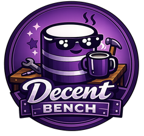

<p align="center">
  
</p>

<h1 align="center">Decent Bench</h1>

<p align="center">
  <strong>The modern, local-first DecentDB desktop workbench.</strong>
</p>

<p align="center">
  <a href="https://github.com/sphildreth/decent-bench/actions/workflows/flutter-phase1.yml">
    
  </a>
  <a href="https://github.com/sphildreth/decent-bench/releases">
    
  </a>
  <a href="LICENSE">
    
  </a>
  
  
</p>

<p align="center">
  Import CSV/TSV, JSON, XML, HTML, Excel, SQLite, and SQL dumps into DecentDB, inspect schema, iterate on SQL in a multi-tab editor, and export shaped results from a fast, responsive desktop app built with Flutter.
</p>

<p align="center">
  <a href="#-features">Features</a> •
  <a href="#-status--100">Status</a> •
  <a href="#-getting-started">Getting Started</a> •
  <a href="#-developer-onboarding">Developer Onboarding</a> •
  <a href="#-roadmap">Roadmap</a> •
  <a href="#-contributing">Contributing</a>
</p>

<p align="center">
  
</p>

---

## ✨ Features

- 🚀 **DecentDB-First:** A fully local-first workflow. Fast open/create, recent files, and intuitive drag-and-drop support.
- 📥 **Smart Import Wizards:** Seamlessly import CSV, JSON, XML, HTML, SQLite, Excel, and SQL dumps (including `.zip`/`.gz` archives). Includes previews, rename/type-override transforms, progress reporting, and summary actions.
- 🛠️ **Modern SQL Workbench:** Iterate in a multi-tab editor with isolated per-tab results, schema-aware autocomplete, editable snippets, and deterministic formatting.
- ⚡ **Performance-Focused:** Background imports, paginated/streamed results grids, and best-effort query cancellation ensure the UI never freezes.
- 🎨 **Workspace Persistence:** Config and app state are safely stored as TOML, providing reliable per-database workspace restoration.
- 📦 **Desktop Native:** Packaged for Linux, macOS, and Windows with a repeatable native-library staging helper.

## 🚀 Status: v1.0.0 

**Decent Bench has reached 1.0.0!** The core MVP loop is fully implemented and stable: import or open a database, inspect schema, run SQL, stream/page through results, and export to CSV.

### Supported File Types

| File type | Action | Details |
| --- | --- | --- |
| `.ddb` | **Open directly** | Main DecentDB workspace format. |
| `.db`, `.sqlite`, `.sqlite3` | **Import Wizard** | Background import with schema preview and table selection. |
| `.csv`, `.tsv`, `.txt`, `.dat`, `.psv` | **Import Wizard** | Delimited text import with header, delimiter, quoting, preview, and type overrides. |
| `.json`, `.ndjson`, `.jsonl` | **Import Wizard** | Structured and line-oriented JSON import with relational previews. |
| `.xml` | **Import Wizard** | XML import with flatten or parent-child normalization strategies. |
| `.html`, `.htm` | **Import Wizard** | HTML table extraction with table selection and header inference. |
| `.xlsx` | **Import Wizard** | Select worksheets and map DecentDB types automatically. |
| `.sql` | **Import Wizard** | Supports common MariaDB/MySQL-style dumps (CREATE TABLE + INSERT). |
| `.zip`, `.gz` | **Unwrap & Import** | Archive wrappers that automatically unwrap supported files and route them to the import flow. |
| `.xls` | *Partial / Hint* | Legacy format. Handled with warnings or prompts to convert to `.xlsx` first. |

## 🚀 Getting Started (End Users)

*Binary releases for Linux, macOS, and Windows will be available on the [Releases](https://github.com/sphildreth/decent-bench/releases) page.*

### Command-line Launch
Packaged desktop builds expose a narrow CLI entry for import flows:
```bash
dbench --import /path/to/source.xlsx
```
This reuses the drag-and-drop detection rules and instantly opens the right import wizard.

## 💻 Developer Onboarding

Want to build from source or contribute? Welcome! 

### Prerequisites

- **Git**
- **Flutter** (stable, desktop tooling enabled)
- OS-specific native toolchain (C++ compiler, etc.)
- **Nim** (to build the local DecentDB native library)
- A sibling `decentdb` checkout (or update the path dependency in `pubspec.yaml`)

**Expected Directory Structure:**
```text
/path/to/source/decent-bench
/path/to/source/decentdb
```

### 1. Build the DecentDB Native Library
```bash
cd ../decentdb
nimble build_lib
```

### 2. Bootstrap the Flutter App
```bash
cd ../decent-bench/apps/decent-bench
flutter pub get
```

### 3. Run Locally
Provide the native library path matching your platform (`libc_api.so`, `libc_api.dylib`, or `c_api.dll`):
```bash
DECENTDB_NATIVE_LIB=/path/to/decentdb/build/libc_api.so flutter run -d linux
```
*(Note: If the sibling build is present, the app can often auto-resolve it without the ENV var).*

### 4. Testing & Validation
```bash
flutter analyze
DECENTDB_NATIVE_LIB=/path/to/decentdb/build/libc_api.so flutter test
DECENTDB_NATIVE_LIB=/path/to/decentdb/build/libc_api.so flutter test integration_test
```

### 5. Packaging Desktop Builds
Build the bundle, then use the staging helper to inject the DecentDB native library:
```bash
flutter build linux
dart run tool/stage_decentdb_native.dart --bundle build/linux/x64/release/bundle
```
*(For macOS use `build/macos/Build/Products/Release/decent_bench.app` and Windows `build/windows/x64/runner/Release`)*.

## 🏗️ Architecture & Configuration

The application stores global configuration and workspace state locally:
- **Linux:** `~/.config/decent-bench/`
- **macOS:** `~/Library/Application Support/Decent Bench/`
- **Windows:** `%APPDATA%\Decent Bench\`

**Project Source of Truth:**
- 📐 [`design/PRD.md`](design/PRD.md) — Product goals and user journeys
- 📝 [`design/SPEC.md`](design/SPEC.md) — Implementation scope (Authoritative)
- 🧠 [`design/adr/README.md`](design/adr/README.md) — Architecture Decision Records
- 🤖 [`AGENTS.md`](AGENTS.md) — Agent instructions and guardrails

## 🗺️ Roadmap

**Completed for 1.0.0:**
- ✅ Drag-and-drop open/import flows
- ✅ Expansive import support: CSV, JSON, XML, HTML, SQLite, Excel, and SQL dumps
- ✅ ZIP & GZip archive wrappers for imports
- ✅ Schema browsing and multi-tab SQL editing
- ✅ Autocomplete, snippets, and deterministic formatter
- ✅ Paged results, query cancellation, and CSV export
- ✅ TOML config and persistent per-database workspaces

**Coming Next (Post-1.0):**
- 🔜 **Expanded Exports:** JSON, Parquet, and Excel formats, plus schema exports and reusable export recipes.
- 🔜 **New Database & Analytical Imports:** DuckDB, Parquet, PostgreSQL dumps, and legacy DBs (Access, DBF).
- 🔜 **New Document & Log Imports:** OpenDocument (`.ods`), YAML, Markdown/PDF tables, and continuous log streams.
- 🔜 **Advanced Import Capabilities:** Computed-column transforms and native legacy binary `.xls` parsing.

## 🤝 Contributing

We love contributions! Before making non-trivial changes, please review the [`SPEC.md`](design/SPEC.md) and our [`AGENTS.md`](AGENTS.md) guidelines.

**Core Rules:**
1. **Performance First:** Keep heavy work off the UI thread. Use isolates.
2. **Paging Everywhere:** Stream data, never fully materialize large results.
3. **ADRs are Mandatory:** Document lasting architectural or product-impacting decisions.
4. **License Compliance:** Only add Apache 2.0 compatible dependencies.

## ❓ FAQ

**Is this a general-purpose database admin tool?**
No. Decent Bench is intentionally **DecentDB-first**. 

**Does the app load entire query results into memory?**
No. Paging and streaming are core design constraints to ensure UI responsiveness.

## 📄 License & Attribution

Decent Bench is open-source under the [Apache License 2.0](LICENSE).  
For third-party dependencies and attributions, see [THIRD_PARTY_NOTICES.md](THIRD_PARTY_NOTICES.md).
